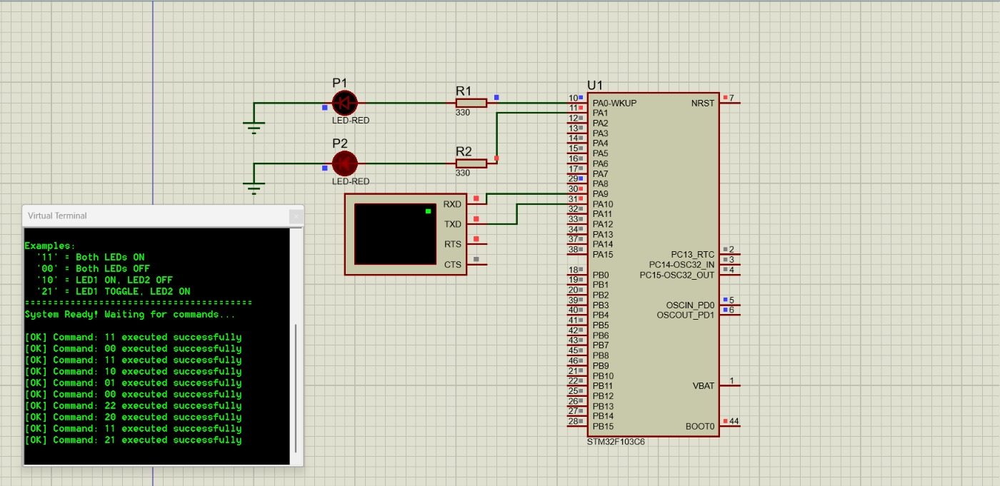

```markdown
# STM32 UART-GPIO Control Project (Rover-ITU Embedded Systems Assignment)

## Overview
This project demonstrates **UART-based digital output control** on an STM32 microcontroller using the **HAL library** in **STM32CubeIDE**, verified through **Proteus simulation**.

Two GPIO pins (PA0 and PA1) are controlled via UART commands sent from a serial terminal (PuTTY / Hercules / Proteus Virtual Terminal).  
Each message contains two digits, where each digit controls one GPIO pin.

| Symbol | Meaning |
|---------|----------|
| `0` | Set pin **LOW** |
| `1` | Set pin **HIGH** |
| `2` | **Toggle** the current pin state |

### Example Commands

| UART Message | PA0 Action | PA1 Action |
|---------------|-------------|-------------|
| `00` | LOW (LED ON if active-LOW) | LOW |
| `11` | HIGH (LED OFF if active-LOW) | HIGH |
| `10` | HIGH | LOW |
| `01` | LOW | HIGH |
| `21` | TOGGLE | HIGH |

---

## Hardware & Software Setup

| Item | Configuration |
|------|----------------|
| **Microcontroller** | STM32F103C6T6 (Blue Pill) |
| **IDE & Framework** | STM32CubeIDE 1.14.0 using HAL drivers |
| **UART Port** | USART1 – PA9 (TX), PA10 (RX) |
| **GPIO Pins** | PA0, PA1 as push-pull outputs |
| **Clock Source** | Internal HSI 8 MHz |
| **Baud Rate** | 115200 bps, 8 data bits, 1 stop bit, no parity |
| **Simulation Tool** | Proteus 8.14 Professional |
| **Serial Terminal** | Virtual Terminal / PuTTY / Hercules |

### Wiring for Proteus Simulation

```

```

---

## How It Works 

1. The MCU continuously waits for two UART characters (`'0'`, `'1'`, `'2'`).
2. Each character determines one pin’s action (LOW, HIGH, or TOGGLE).
3. The `apply_action()` function executes the command using HAL functions:
   ```c
   HAL_GPIO_WritePin(GPIOx, GPIO_Pin, GPIO_PIN_RESET/SET);
   HAL_GPIO_TogglePin(GPIOx, GPIO_Pin);
````

4. After updating the pins, the MCU sends a UART message confirming their new states.

**Example Terminal Output:**

```
READY: send two digits (0=LOW,1=HIGH,2=TOGGLE)
CMD=10  P1=HIGH  P2=LOW
CMD=21  P1=TOGGLED  P2=HIGH
```

---

## Why STM32F103C6

* Affordable and widely used **Blue Pill** development board
* Fully supported by **STM32CubeIDE** and **HAL library**
* Easy to simulate in **Proteus**
* Includes **USART1** and multiple GPIO pins
* Ideal for entry-level embedded systems and communication experiments

---

## Files Included

| File / Folder                          | Description                                             |
| -------------------------------------- | ------------------------------------------------------- |
| `main.c`                               | Main program implementing UART receive and GPIO control |
| `uart_gpio_toggle.ioc`                 | STM32CubeIDE configuration (pinout & clock setup)       |
| `/Proteus/simulation_sch_STM32.pdsprj` | Proteus simulation file                                 |
| `Result.png`                           | Screenshot of Proteus simulation results                |
| `/Drivers`                             | HAL and CMSIS driver source files                       |
| `/Debug`                               | Compiled output files (.elf, .hex, .map)                |
| `README.md`                            | Documentation file (this one)                           |

---

## Simulation Results

| UART Input | LED Behavior           |
| ---------- | ---------------------- |
| `00`       | Both LEDs ON           |
| `11`       | Both LEDs OFF          |
| `21`       | LED1 toggles, LED2 OFF |



---

## Tools & Versions

| Tool              | Version                 |
| ----------------- | ----------------------- |
| STM32CubeIDE      | 1.14.0                  |
| STM32 HAL Drivers | v1.1.4 (auto-generated) |
| Proteus           | 8.14 Professional       |
| ARM GCC Toolchain | 10.3.1                  |
| Windows           | 10 / 11                 |
| GitHub            | Latest                  |

---

## Author

**Ömer CIRBE**
Electronics & Communication Engineering Student
Istanbul Technical University (ITU) – Rover Team
[cirbe24@itu.edu.tr](mailto:cirbe24@itu.edu.tr)


